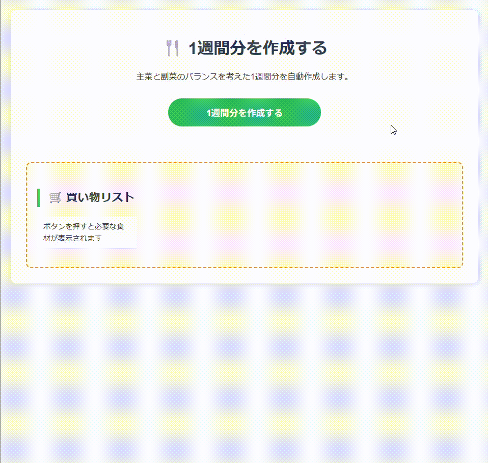

1週間献立マネージャー (Weekly Recipe Manager)
楽天レシピAPIを活用し、主菜・副菜のバランスを考慮した
5日分の献立を自動生成するフルスタックWebアプリケーションです。

🌟 概要
「毎日の献立を考える負担」と「買い物の無駄」を減らすために開発しました。
ボタン一つで、楽天レシピの最新ランキングからランダムに献立を抽出し、
必要な材料を重複なくまとめた買い物リストを提供します。

## 📝 開発の経緯
このプロジェクトは、私自身の日常生活における「名もなき家事」の負担を軽減したいという思いから始まりました。

### 抱えていた課題
- **献立決定の心理的負荷**: 毎日「今日何作ろう？」とゼロから考える作業が大きなストレスになっていた。
- **買い物の効率化不足**: 献立を決めてから必要な材料をメモする際、複数のレシピで重複する材料を整理するのが手間だった。
- **栄養バランスの偏り**: 忙しいとつい同じメニューの繰り返しになり、食材のバリエーションが乏しくなっていた。

### 解決のためのアプローチ
これらの課題をエンジニアリングの力で解決するため、以下の機能を備えたツールを開発しました。
1. **思考の自動化**: 楽天レシピAPIのランキングデータを活用し、主菜と副菜を自動で組み合わせることで、意思決定のプロセスを排除。
2. **データの正規化と統合**: 各レシピの材料データをプログラムで解析・統合し、重複を自動で取り除いた「最短ルートの買い物リスト」を生成。
3. **継続的な改善**: 誰でも簡単に（ボタン一つで）実行できるよう、軽量なPythonサーバーと直感的なWebインターフェースを連携。

このツールによって、献立に悩む時間を「料理を楽しむ時間」や「他の作業に充てる時間」へと変えることを目指しました。

🚀 主な機能
献立自動生成: 主菜（肉・魚）と副菜をバランスよく5日分選出。
買い物リスト自動作成: 全レシピの材料をスキャンし、重複を排除したリストを表示。
チェックリスト機能: 買い物中にブラウザ上でチェックを入れられるUI。
最新データ連携: 楽天レシピAPIからリアルタイムで情報を取得。

🛠 技術スタック
Backend
Python 3.x
Flask: Web API サーバーの構築
Flask-CORS: クロスドメイン通信の制御
Requests: 楽天APIとの通信
正規表現 (re): 材料名データのクレンジング処理

Frontend
JavaScript (ES6+): 非同期通信 (fetch, async/await)、DOM操作
HTML5 / CSS3: レスポンシブデザイン

📂 セットアップ方法

1. リポジトリのクローン
  <Bash>
  git clone https://github.com/あなたのユーザー名/リポジトリ名.git
  cd リポジトリ名

2. ライブラリのインストール
  <Bash>
  pip install -r requirements.txt

3. APIキーの設定
  プロジェクトのルートディレクトリに .env ファイルを作成し、
  楽天デベロッパーIDを入力してください。
  <Plaintext>
  RAKUTEN_APP_ID=あなたのアプリID

5. 実行
  <Bash>
  # サーバーの起動
  python main.py
  その後、ブラウザで index.html を開いてください。

💡 こだわり・工夫した点
API制限への対応: 
楽天APIの「1秒間に1リクエスト」という制限に対し、
Python側で適切な待機時間（time.sleep）を設けることで、
エラー（Status 429）を回避し安定した取得を実現しました。
ユーザー体験 (UX): 
献立生成には時間がかかるため、JavaScriptでボタンの状態を「作成中」に変化させ、
ユーザーが状況を把握できるようにしました。
データクレンジング: 
APIから取得できる材料名に含まれる記号（★や●など）を正規表現で除去し、
視認性の高い買い物リストを作成しました。

⚠️ 注意事項
本アプリはローカル環境（localhost:5000）での動作を前提としています。
楽天レシピAPIの利用規約に従ってご利用ください。
